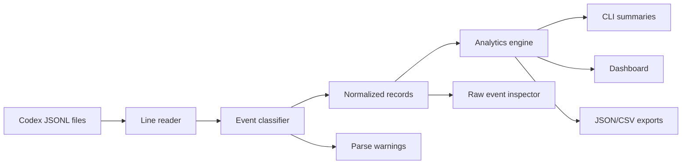

# Architecture

## Recommended Stack

The first implementation should be a TypeScript monorepo:

- `packages/parser`: Codex JSONL parsing and normalization
- `packages/analytics`: project grouping, aggregation, bucketing, exports
- `apps/cli`: command-line access to parser and analytics
- `apps/web`: local dashboard
- `fixtures/codex`: sanitized JSONL fixtures

TypeScript keeps the parser easy to contribute to and lets the CLI and dashboard share the same code. If performance becomes a real blocker, a Rust scanner can be introduced behind the same normalized data contract.

## Data Flow

## Core Packages

### Parser

Responsibilities:

- read JSONL files safely
- parse one line at a time
- classify known event types
- preserve unknown event payloads
- emit normalized records and warnings
- avoid throwing away raw fields needed for future support

### Analytics

Responsibilities:

- group sessions by project
- bucket activity by time window
- count user messages and unique normalized messages
- aggregate token usage
- calculate model/session/project breakdowns
- emit export-ready summary objects

### CLI

Initial commands:

- `summary`: show project/date usage summary
- `projects`: list discovered projects
- `sessions`: list sessions for a project/date range
- `export`: write JSON or CSV

### Web

Initial views:

- project selector
- date range controls
- metric cards
- messages by day/hour charts
- token trend and model breakdown
- sessions table
- raw event inspector

## Storage

MVP can parse on demand from local files. Later versions can add a local cache or index for speed.

Any cache should:

- live on the user's machine
- be invalidated by file path, size, and modification time
- store derived data separately from raw sensitive content where practical
- be documented clearly

## Privacy Boundary

The default product boundary is local machine only.

No telemetry, hosted sync, remote processing, or automatic issue-report upload should be added without a clear opt-in design and documentation update.

## Versioning Strategy

Codex logs should be treated as an evolving event stream. Parser support should be described by observed event shapes and fixture coverage rather than claiming a complete official schema.

Add an architecture decision record in `docs/decisions/` whenever a major data-model, privacy, or packaging decision is made.
