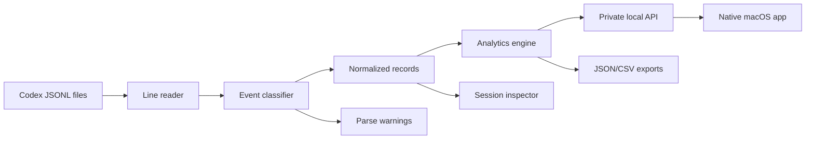

# Architecture

## Stack

Codex Log Viewer is a native macOS app backed by a local TypeScript parsing engine:

- `apps/macos`: native SwiftUI macOS app
- `apps/server`: private local HTTP API engine launched by the app
- `apps/cli`: command-line access to parser and analytics for automation
- `packages/parser`: Codex JSONL parsing and normalization
- `packages/analytics`: project grouping, aggregation, bucketing, search, and exports
- `fixtures/codex`: sanitized JSONL fixtures

There is intentionally no browser dashboard or Electron shell. Codex logs live on the user's machine, so the product surface is the native app. The local HTTP engine is an implementation detail used to reuse the tested parser and analytics packages.

## Product Flow

The source-build user flow is:

1. Start the app with `npm run app:mac`.
2. Use the native app to select sources, projects, date ranges, message searches, sessions, and exports.

The packaged user flow is:

1. Build or download `Codex Log Viewer.app`.
2. Launch the app from Finder.
3. Use the native app without a repo checkout or terminal process.

The CLI remains available for automation and test smoke checks, but it is not the primary product interface.

## Data Flow

## Core Packages

### Parser

Responsibilities:

- read JSONL files safely
- parse one line at a time
- classify known event types
- preserve unknown event payloads
- emit normalized records and warnings
- avoid throwing away raw fields needed for future support

### Analytics

Responsibilities:

- group sessions by project
- bucket activity by time window
- count user messages and unique normalized messages
- aggregate token usage
- search messages across all parsed projects
- calculate model/session/project breakdowns
- emit export-ready summary objects

### macOS App

Responsibilities:

- launch as the primary native app from `apps/macos`
- start the private local API engine on an app-owned `127.0.0.1` port
- generate and pass an ephemeral token to the local engine
- render projects, summaries, sessions, search, and inspection with SwiftUI
- provide native project sidebar, split-column browser, header-level activity filtering, section switching, toolbar, tables, menu commands, and interaction behavior
- reconstruct selected user-message interactions into readable response, tool activity, context, token, and timing sections
- provide native file picking, local recent-source and date-filter settings, packaged app smoke support, and release metadata

### Local API Engine

Responsibilities:

- expose `/api/projects`, `/api/summary`, `/api/sessions`, `/api/session`, `/api/messages/search`, and `/api/export`
- read local Codex files from Node inside the user's machine
- bind only to loopback by default
- require the per-run bearer token for data endpoints
- avoid serving a web UI

### CLI

Supported commands:

- `summary`: show project/date usage summary
- `projects`: list discovered projects
- `sessions`: list sessions for a project/date range
- `export`: write JSON or CSV

## Storage

The macOS app uses a persistent local parsed cache for speed. The local engine receives the cache directory from the native app and stores cache files under Application Support, outside the repository.

The cache must:

- live on the user's machine
- be invalidated by file path, size, and modification time
- store derived data separately from raw sensitive content where practical
- be documented clearly

The cache stores parsed records, including message text needed for search and session details, but does not store raw JSONL lines. Search remains in-memory over the loaded parsed corpus; a SQLite FTS index can be added later if search latency becomes the bottleneck.

## Privacy Boundary

The default product boundary is local machine only.

No telemetry, hosted sync, remote processing, or automatic issue-report upload should be added without a clear opt-in design and documentation update.

## Versioning Strategy

Codex logs should be treated as an evolving event stream. Parser support should be described by observed event shapes and fixture coverage rather than claiming a complete official schema.

Add an architecture decision record in `docs/decisions/` whenever a major data-model, privacy, or packaging decision is made.
